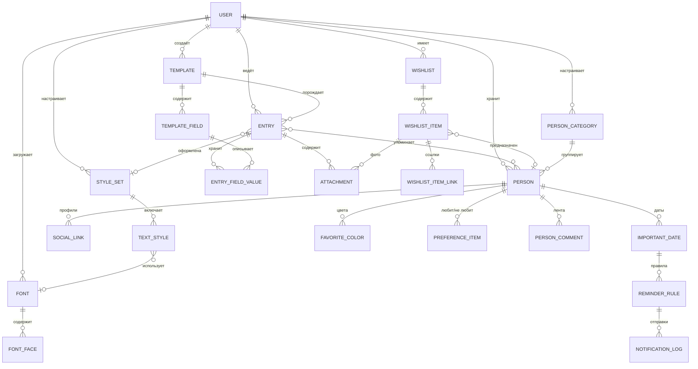

# 5. Модель данных

Раздел описывает сущности, вытекающие из требований. Типы указаны обобщённо, без привязки
к конкретной СУБД. Все сущности принадлежат пользователю (`user_id`) и содержат
`created_at` / `updated_at`; в таблицах ниже эти поля не повторяются.

## 5.1 ER-диаграмма

## 5.2 Записи, шаблоны, оформление

### ENTRY — запись дневника

| Поле | Тип | Примечание |
| --- | --- | --- |
| id | uuid | |
| title | string(300) | Может быть пустым — тогда в списке показывается начало текста |
| entry_date | date | Дата, к которой относится запись; по умолчанию — сегодня |
| body | json | Структура документа (см. решение в 2.1) |
| body_markdown | text | Денормализованная Markdown-проекция для полнотекстового поиска и экспорта |
| template_id | fk → TEMPLATE | Nullable |
| style_set_id | fk → STYLE_SET | Nullable, иначе набор по умолчанию |
| tags | string[] | |
| is_pinned | bool | |
| deleted_at | datetime | Мягкое удаление, корзина |

### TEMPLATE / TEMPLATE_FIELD

| TEMPLATE | Тип | Примечание |
| --- | --- | --- |
| id | uuid | |
| name | string(120) | |
| icon | string | Эмодзи или имя иконки |
| kind | enum | `system` / `user` |
| body_markdown | text | Предзаполненное тело записи |
| is_archived | bool | |

| TEMPLATE_FIELD | Тип | Примечание |
| --- | --- | --- |
| id | uuid | |
| template_id | fk | |
| key | slug | Уникален внутри шаблона; неизменяем после создания |
| label | string(120) | |
| type | enum | `text`, `long_text`, `number`, `date`, `date_range`, `rating`, `select`, `multiselect`, `checkbox`, `url`, `image`, `color`, `person`, `tags` |
| options | json | Варианты для `select`, шкала для `rating`, ограничения для `number` |
| is_required | bool | |
| default_value | json | |
| position | int | |

### ENTRY_FIELD_VALUE

| Поле | Тип | Примечание |
| --- | --- | --- |
| entry_id | fk | |
| field_id | fk | |
| value | json | Хранит значение любого типа; для сортировки и статистики дублируется в типизированные колонки `value_number`, `value_date`, `value_text` |

Ограничение: `unique(entry_id, field_id)`.

### FONT / FONT_FACE

| FONT | Тип | Примечание |
| --- | --- | --- |
| id | uuid | |
| family_name | string(120) | Уникально в пределах пользователя |
| license_confirmed_at | datetime | Подтверждение права использования (ED-66) |
| total_size_bytes | int | Для контроля квоты |

| FONT_FACE | Тип | Примечание |
| --- | --- | --- |
| font_id | fk | |
| weight | int | 100…900 |
| style | enum | `normal` / `italic` |
| format | enum | `woff2` / `woff` / `ttf` / `otf` |
| file_path | string | |
| size_bytes | int | |
| has_cyrillic | bool | Результат проверки покрытия (ED-68) |

Ограничение: `unique(font_id, weight, style)`.

### STYLE_SET / TEXT_STYLE

| STYLE_SET | Тип | Примечание |
| --- | --- | --- |
| id | uuid | |
| name | string(120) | |
| is_default | bool | Ровно один набор пользователя должен быть набором по умолчанию |

| TEXT_STYLE | Тип | Примечание |
| --- | --- | --- |
| style_set_id | fk | |
| role | enum | `body`, `h1`, `h2`, `h3`, `quote`, `caption`, `code`, `custom` |
| name | string(120) | Для `custom` |
| font_id | fk → FONT | Nullable → системный шрифт |
| font_size_px | decimal | |
| font_weight | int | |
| is_italic / is_underline | bool | |
| color / background_color | hex | |
| text_align | enum | `left`, `center`, `right`, `justify` |
| line_height | decimal | Множитель |
| letter_spacing_px | decimal | |
| margin_top_px / margin_bottom_px | decimal | |
| first_line_indent_px | decimal | |

### ATTACHMENT — единое хранилище файлов

Используется записями, позициями вишлиста, комментариями и аватарами.

| Поле | Тип | Примечание |
| --- | --- | --- |
| id | uuid | |
| owner_type / owner_id | polymorphic | `entry`, `wishlist_item`, `person`, `person_comment` |
| kind | enum | `image` / `file` |
| file_path | string | |
| mime_type | string | Проверяется по содержимому, а не по расширению |
| width / height | int | Для изображений |
| size_bytes | int | |
| position | int | Порядок; первое изображение — обложка |

## 5.3 Вишлист

### WISHLIST

| Поле | Тип | Примечание |
| --- | --- | --- |
| id | uuid | |
| name | string(200) | |
| description | text | |
| public_slug | string | Nullable, уникально глобально; наличие означает включённую публичную ссылку (WL-11) |
| position | int | |

### WISHLIST_ITEM

| Поле | Тип | Примечание |
| --- | --- | --- |
| id | uuid | |
| wishlist_id | fk | |
| title | string(200) | Обязательно |
| price_amount | decimal(12,2) | Nullable |
| price_amount_max | decimal(12,2) | Nullable, для диапазона цен |
| price_currency | char(3) | ISO 4217 |
| price_note | string(100) | Свободное значение вместо числа («не знаю») |
| comment | text | |
| priority | enum | `high` / `medium` / `low`, nullable |
| status | enum | `active`, `gifted`, `bought_self`, `not_relevant` |
| for_person_id | fk → PERSON | Nullable |
| size_note | string(120) | |
| tags | string[] | |
| position | int | |

### WISHLIST_ITEM_LINK

| Поле | Тип | Примечание |
| --- | --- | --- |
| item_id | fk | |
| url | text | Нормализованный, схема только `http`/`https` |
| label | string(120) | Nullable → показывается домен |
| position | int | |

## 5.4 Люди

### PERSON_CATEGORY

| Поле | Тип | Примечание |
| --- | --- | --- |
| id | uuid | |
| name | string(80) | Уникально в пределах пользователя |
| color | hex | |
| icon | string | |
| position | int | |
| is_system_default | bool | Создана автоматически при регистрации |

### PERSON

| Поле | Тип | Примечание |
| --- | --- | --- |
| id | uuid | |
| display_name | string(200) | Обязательно |
| first_name / last_name / middle_name | string(120) | |
| nicknames | string[] | |
| preferred_address | string(120) | |
| category_id | fk | Nullable, основная категория |
| extra_category_ids | fk[] | Для PPL-06 (многие-ко-многим) |
| avatar_attachment_id | fk | |
| relation_note | string(200) | «сестра», «коллега по проекту» |
| met_at_note | string(200) | |
| phones | json[] | `{value, label}` |
| emails | json[] | `{value, label}` |
| address | text | |
| timezone | string | IANA, например `Europe/Moscow` |
| note | text | Постоянная заметка (PPL-90) |
| is_archived | bool | |

### SOCIAL_LINK

| Поле | Тип | Примечание |
| --- | --- | --- |
| person_id | fk | |
| url | text | Нормализованный |
| platform | enum | Определяется по домену; `other` для нераспознанных |
| label | string(120) | Nullable |
| position | int | |

### IMPORTANT_DATE

| Поле | Тип | Примечание |
| --- | --- | --- |
| id | uuid | |
| person_id | fk | |
| kind | enum | `birthday`, `anniversary`, `met`, `wedding`, `memorial`, `custom` |
| label | string(120) | Обязателен для `custom` |
| month / day | int | Всегда заполнены |
| year | int | Nullable (PPL-42) |
| is_annual | bool | По умолчанию `true` |
| notify_enabled | bool | Переключатель «уведомлять» (PPL-50) |

Ограничение: не более одной даты с `kind = birthday` на человека.

### REMINDER_RULE

| Поле | Тип | Примечание |
| --- | --- | --- |
| id | uuid | |
| important_date_id | fk | |
| offset_days | int | 0 — в день события; 7 — за неделю |
| mode | enum | `once` — один раз в этот день; `daily_until_event` — ежедневно от смещения до даты (PPL-54) |
| time_of_day | time | По умолчанию 10:00 |
| channels | enum[] | `in_app`, `push`, `email` |

Ограничение: `unique(important_date_id, offset_days, mode)`.

### NOTIFICATION_LOG

| Поле | Тип | Примечание |
| --- | --- | --- |
| id | uuid | |
| reminder_rule_id | fk | |
| event_year | int | Год конкретного наступления события |
| scheduled_for | datetime | С учётом часового пояса пользователя |
| sent_at | datetime | Nullable, пока не отправлено |
| status | enum | `pending`, `sent`, `failed`, `skipped_dnd`, `missed` |
| idempotency_key | string | `rule_id + event_year + scheduled_for`, уникально (PPL-62) |

### FAVORITE_COLOR

| Поле | Тип | Примечание |
| --- | --- | --- |
| person_id | fk | |
| hex | char(7) | Хранится нормализованно в виде `#RRGGBB` в нижнем регистре |
| label | string(120) | Nullable |
| position | int | Первый цвет — основной |

### PREFERENCE_ITEM — «любит» / «не любит»

| Поле | Тип | Примечание |
| --- | --- | --- |
| person_id | fk | |
| kind | enum | `like` / `dislike` |
| text | text | |
| category | string(80) | Nullable (PPL-84) |
| is_critical | bool | Аллергии и важные ограничения (PPL-87) |
| position | int | |

### PERSON_COMMENT

| Поле | Тип | Примечание |
| --- | --- | --- |
| id | uuid | |
| person_id | fk | |
| body | json | Тот же формат, что тело записи, но с ограниченным набором блоков |
| happened_at | datetime | По умолчанию — момент создания, редактируется |
| is_pinned | bool | |

## 5.5 Общие правила валидации

| Правило | Область |
| --- | --- |
| Обязательные поля: `ENTRY.entry_date`, `WISHLIST_ITEM.title`, `PERSON.display_name`, `PERSON_CATEGORY.name` | Все формы |
| HEX-цвет приводится к `#rrggbb`; принимается ввод с `#` и без, 3 и 6 символов | Цвета, стили |
| URL: разрешены только схемы `http` и `https`; отсутствующая схема достраивается как `https`; параметры отслеживания удаляются | Соцсети, ссылки вишлиста |
| Изображения: типы `jpeg`, `png`, `webp`, `heic`, `gif`; до 15 МБ на файл; MIME проверяется по содержимому; EXIF-ориентация применяется, геометки удаляются | Все вложения |
| Шрифты: `woff2`, `woff`, `ttf`, `otf`; до 5 МБ на файл, 50 МБ на пользователя; структура проверяется парсером | Шрифты |
| Дата окончания не раньше даты начала | Шаблон книги, диапазоны дат |
| Цена ≥ 0; `price_amount_max` ≥ `price_amount` | Вишлист |
| Удаление сущности с потомками (категория, шаблон, вишлист, шрифт) требует явного выбора действия | Все модули |
| Мягкое удаление и корзина на 30 дней для записей, людей и позиций вишлиста | Все модули |
