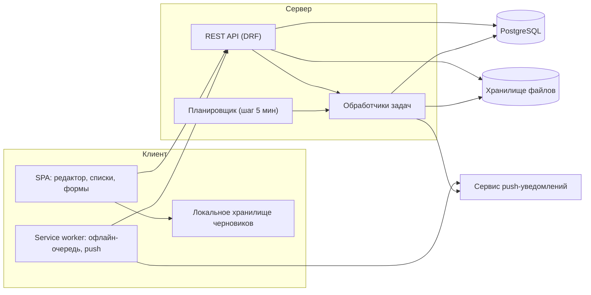

# 12. Архитектура и технические решения

Раздел предлагает архитектуру, достаточную для требований разделов 2–6, и объясняет выбор в
местах, где ошибка дорого стоит: формат документа, библиотека редактора, генерация PDF,
планировщик напоминаний, поиск.

Все решения ниже — предложения. Окончательные ответы на Q1–Q4
([07-open-questions.md](07-open-questions.md)) определяют, останутся ли они в силе.

---

## 12.1 Принципы

1. **Данные важнее функций.** Ни одна оптимизация не оправдывает риск потери текста
   (NFR-70). Поэтому черновик пишется локально до подтверждения сервером.
2. **Готовые решения вместо своих** в местах, где своя реализация традиционно
   недооценивается: редактор, генерация PDF, разбор шрифтов, полнотекстовый поиск.
3. **Приватность по умолчанию.** Внешние запросы — только по явному действию (NFR-07).
4. **Данные переносимы.** Экспорт есть с первого дня (NFR-20), формат хранения не должен
   быть «ловушкой».

## 12.2 Предлагаемый стек

| Слой | Выбор | Обоснование |
| --- | --- | --- |
| Backend | Python + Django + Django REST Framework | Совпадает со стеком, уже используемым в репозитории; быстрая разработка админки, миграций, прав доступа |
| БД | PostgreSQL 16 | Нужны JSON-поля (тела записей, значения полей шаблонов), полнотекстовый поиск с русской морфологией, `pg_trgm` для нечёткого поиска имён |
| Файлы | S3-совместимое хранилище | Фото и шрифты не должны лежать рядом с кодом; нужны подписанные ссылки (NFR-02) |
| Очередь задач | Celery + Redis (или RQ) | Напоминания, генерация PDF, обработка изображений и шрифтов — всё это фоновые задачи |
| Расписание | Celery Beat, шаг 5 минут | Достаточная точность для напоминаний в заданное время (±5 мин по 9.5) |
| Frontend | SPA (React) + TypeScript | Редактор — сложный клиентский компонент; серверный рендеринг здесь не помогает |
| Редактор | ProseMirror через TipTap | См. 12.4 |
| Доставка | PWA: service worker + Web Push (VAPID) | Один код на десктоп и телефон, офлайн-режим и уведомления без публикации в магазинах приложений (Q2) |
| PDF | Headless Chromium (Playwright) по HTML-шаблону | См. 12.6 |

Компоненты:

## 12.3 Формат хранения документа

Рекомендация из 2.1: основной формат — **структура документа** (JSON, дерево блоков и
инлайн-разметки), Markdown — импорт и экспорт.

Реализация:

- `ENTRY.body` — дерево документа ProseMirror; схема документа версионируется полем
  `schema_version`, миграции применяются лениво при открытии записи.
- `ENTRY.body_markdown` — денормализованная проекция, пересчитывается при каждом сохранении.
  Нужна для полнотекстового поиска, экспорта архива (NFR-20) и как «человекочитаемая»
  резервная копия на случай проблем со структурой.
- Обратимость Markdown ↔ структура покрывается тестами на наборе документов
  (см. 14.5, TC-ED-01): структура → Markdown → структура должна давать тот же результат
  для всех конструкций, выразимых в Markdown.

Оформление, невыразимое в Markdown (цвет, выравнивание, шрифт, кегль), хранится атрибутами
узлов структуры. При экспорте в Markdown оно теряется — это ожидаемое поведение (2.5).

## 12.4 Выбор библиотеки редактора

Своя реализация WYSIWYG исключена: требования 2.2 (панель со всеми группами кнопок,
таблицы, списки, чек-листы, стили, вставка из Word) в сумме дают многолетнюю работу с
бесконечным потоком браузерных особенностей.

| Вариант | Плюсы | Минусы | Вывод |
| --- | --- | --- | --- |
| **ProseMirror / TipTap** | Строгая схема документа, надёжная модель транзакций, готовые расширения (таблицы, чек-листы, упоминания), совместные правки при необходимости | Требует времени на освоение модели | **Рекомендуется** |
| Lexical | Быстрый, современный, хорошая производительность | Экосистема расширений моложе, чаще меняется API | Резервный вариант |
| Slate | Гибкий, простой старт | Исторически нестабильные релизы, свои реализации базовых вещей | Не рекомендуется |
| Quill | Быстрый старт, готовая панель | Модель Delta плохо ложится на произвольную структуру блоков и таблицы | Не подходит под 2.2 |

Ключевой критерий выбора: требуется **строгая схема документа**, иначе невозможно
гарантировать обратимость в Markdown и безопасность вставки из внешних редакторов (ED-06).

## 12.5 Шрифты

| Задача | Решение |
| --- | --- |
| Проверка файла (ED-62) | Разбор `fontTools` в фоновой задаче: если файл не разбирается — отклонить, не пытаясь починить |
| Проверка кириллицы (ED-68) | Проверка наличия диапазона U+0400–U+04FF в таблице `cmap` |
| Конвертация и облегчение (ED-69) | `fontTools` → `woff2`; подмножество символов по мере надобности |
| Раздача | Статически, с длинным кешем по хешу содержимого в имени файла; `Content-Type: font/woff2`; запрет исполнения |
| Подключение в клиенте | `@font-face` с `font-display: swap` (NFR-43); список активных шрифтов приходит вместе с набором стилей |
| Квота (Q16) | Счётчик `total_size_bytes` у шрифта и суммарный у пользователя; проверка до записи файла |

## 12.6 Генерация PDF

| Вариант | Плюсы | Минусы |
| --- | --- | --- |
| **Headless Chromium (Playwright/Puppeteer) по HTML** | Полная поддержка CSS, встраивание шрифтов, точное соответствие экранному оформлению, простые макеты 3.4 | Тяжёлый процесс, нужен отдельный контейнер |
| WeasyPrint | Чистый Python, легче в эксплуатации | Ограниченная поддержка современного CSS, сложнее добиться совпадения с экраном |
| ReportLab | Полный контроль над раскладкой | Макеты пишутся кодом; для трёх макетов с фото это дорого |
| Клиентская генерация (pdf-lib) | Не грузит сервер, данные не покидают устройство | Ограничения по шрифтам и качеству вёрстки, тяжёлые списки в браузере |

Рекомендация — **HTML-шаблон + headless Chromium**: те же CSS-стили, что в приложении,
дают одинаковое оформление на экране и в PDF (WL-25), а встраивание шрифта решает проблему
кириллицы (AS-08).

Технические требования к реализации:

- Шрифт встраивается в документ обязательно; отсутствие кириллицы приводит к подстановке и
  предупреждению в диалоге экспорта (11.1).
- Изображения масштабируются до размера, нужного макету, **до** вставки в HTML (3.4, NFR-45).
- Разрыв страниц: `break-inside: avoid` на карточке позиции.
- Экспорт — фоновая задача с прогрессом (NFR-44) и ссылкой на готовый файл с ограниченным
  сроком жизни.

## 12.7 Планировщик напоминаний

Самая рискованная логика (см. риски в 7). Алгоритм:

1. **Материализация наступлений.** Для каждой активной `IMPORTANT_DATE` с `notify_enabled`
   вычисляются наступления на 13 месяцев вперёд. Для ежегодных дат — по паре «месяц, день»
   в году пользователя; 29 февраля в невисокосный год отображается на 28 февраля (PPL-44).
2. **Раскрытие правил.** Для каждого наступления и каждого `REMINDER_RULE` считаются моменты
   отправки: `дата наступления − offset_days` в `time_of_day` по часовому поясу пользователя;
   режим `daily_until_event` разворачивается в набор дней от смещения до самого события
   (PPL-54) с ограничением по Q13.
3. **Запись в журнал.** Каждый момент попадает в `NOTIFICATION_LOG` со статусом `pending` и
   уникальным `idempotency_key` (правило + год события + запланированное время). Повторный
   расчёт не создаёт дублей — вставка конфликтует по уникальному ключу (PPL-62).
4. **Отправка.** Планировщик раз в 5 минут берёт `pending` со `scheduled_for <= now`,
   отправляет по включённым каналам и переводит в `sent`. Отправка идемпотентна и
   переживает перезапуск (NFR-72).
5. **Тихие часы.** Попадание в интервал «не беспокоить» переносит отправку на его окончание
   со статусом `skipped_dnd` у исходной записи (PPL-64).
6. **Просроченные.** Записи старше 24 часов помечаются `missed` и не отправляются; при
   следующем открытии приложения показываются как пропущенные, если событие ещё не прошло
   (PPL-63).

Пересчёт наступлений запускается при: изменении даты, изменении правил, смене часового пояса
пользователя, а также ежесуточно — чтобы горизонт всегда оставался в 13 месяцев.

Обязательные тесты — в 14.5 (TC-DATE-01…TC-DATE-07): 29 февраля, дата без года, переход
на летнее время, смена часового пояса пользователя, повторный запуск задачи, отключение
уведомлений в середине цикла.

## 12.8 Поиск

| Задача | Решение |
| --- | --- |
| Полнотекстовый поиск с морфологией (SRCH-06) | `tsvector` с конфигурацией `russian`, обновляется триггером по `body_markdown`, заголовку, полям шаблона и заметкам |
| Нечёткое совпадение имён (SRCH-07) | `pg_trgm` с индексом по именам и прозвищам |
| Группировка по типам (SRCH-02) | Отдельные запросы к каждому типу с общим ограничением и объединением на сервере |
| Подсветка (SRCH-05) | `ts_headline` для фрагментов |
| Скорость (SRCH-10) | GIN-индексы; поиск по мере ввода с задержкой 200 мс и отменой предыдущего запроса |

Внешний поисковый движок (Elasticsearch и подобные) на объёмах личного дневника избыточен и
добавляет ещё один компонент к эксплуатации.

## 12.9 Изображения и вложения

- Обработка в фоновой задаче: проверка типа по содержимому (не по расширению), удаление EXIF
  вместе с геометками (NFR-08), поворот по ориентации, генерация трёх размеров
  (миниатюра 200 px, средний 800 px, оригинал).
- Формат выдачи — `webp` с запасным `jpeg`.
- Доступ только по подписанным ссылкам с коротким сроком действия (NFR-02).
- Файлы удаляются из хранилища после окончательного удаления объекта-владельца
  (по истечении 30 дней корзины), а не сразу — иначе восстановление вернёт запись без фото.

## 12.10 Офлайн и синхронизация

- Черновики записей хранятся в IndexedDB и синхронизируются при появлении сети (NFR-30).
- Клиент ведёт очередь операций с локальными идентификаторами; сервер отвечает
  окончательными, клиент их подменяет.
- Конфликты: у записи есть `updated_at` и `revision`; при расхождении сервер сохраняет
  обе версии (вторая — как версия в истории, NAV-43) и помечает запись как конфликтную,
  чтобы пользователь выбрал (NFR-32). Молчаливая перезапись запрещена.
- Push-уведомления доставляются service worker'ом; при отсутствии разрешения на push
  напоминания остаются внутри приложения (PPL-61).

## 12.11 Безопасность

| Мера | Где |
| --- | --- |
| Проверка владельца на каждом объекте, а не только аутентификации | Все эндпоинты (NFR-01) |
| Подписанные ссылки на файлы с коротким TTL | Вложения, шрифты, готовые PDF |
| Санитизация HTML при выводе и экспорте | Тела записей, комментарии, заметки (NFR-09) |
| Белый список схем URL (`http`, `https`) | Соцсети, ссылки вишлиста (PPL-26) |
| CSP без `unsafe-inline`, запрет сторонних источников | Клиент |
| Ограничение частоты запросов | Вход, регистрация, публичные ссылки на вишлист |
| Публичные страницы: `noindex`, отзыв ссылки немедленный | WL-11, NFR-06 |
| Логи без содержимого записей | Наблюдаемость (NFR-73) |

## 12.12 Музыкальный виджет

Единственный модуль, зависящий от внешнего сервиса ([15-music.md](15-music.md)), поэтому
для него важны три технических решения.

**Один плеер на всё приложение.** Экземпляр плеера создаётся один раз и живёт выше дерева
экранов, а виджеты лишь управляют им. Иначе переход между записями пересоздаёт плеер и
музыка прерывается (MUS-08), а несколько плееров начинают играть одновременно (MUS-09).

**Отложенная загрузка (facade).** До нажатия «Играть» на странице нет ни `iframe`, ни
скриптов внешнего сервиса — только закешированная у нас обложка (MUS-40, MUS-53). Это
одновременно приватность (NFR-12), скорость открытия записи (NFR-40) и защита от ситуации,
когда десять дисков на экране тянут десять сторонних плееров.

**Метаданные и доступность — на сервере.** Разбор ссылки, oEmbed-запрос, кеширование
обложки и определение состояния (`ok`, `removed`, `embedding_denied`, `region_blocked`,
`age_restricted`) выполняет сервер (MUS-30, MUS-32). Причины: клиент не должен обращаться к
внешним доменам напрямую до согласия, результат должен быть одинаковым для клиента,
мини-плеера и экспорта, а региональные ограничения корректнее определять по стороне
пользователя с явной пометкой «проверено для сервера — у вас может отличаться».

Фоновая проверка доступности треков (MUS-33) — периодическая задача с ограничением частоты
обращений к внешнему сервису: пачками, с интервалом, не чаще одного прохода в неделю на трек.
Результат пишется в `availability` и `availability_checked_at`; трек никогда не удаляется
автоматически (MUS-34).

Клиентская реализация опирается на официальный API встраиваемого плеера (события смены
состояния, позиция, ошибки). Собственный аудиопоток не используется ни при каких условиях
(MUS-43).

## 12.13 Эксплуатация

- Миграции БД — только обратимо совместимые: сначала добавление поля, потом перенос данных,
  потом удаление старого.
- Ежедневные резервные копии БД и файлов с проверкой восстановления.
- Метрики: доставка уведомлений, длительность генерации PDF, ошибки автосохранения
  (NFR-74).
- Технические ошибки собираются без личных данных; в отчёт попадают идентификаторы
  объектов, но не их содержимое.
